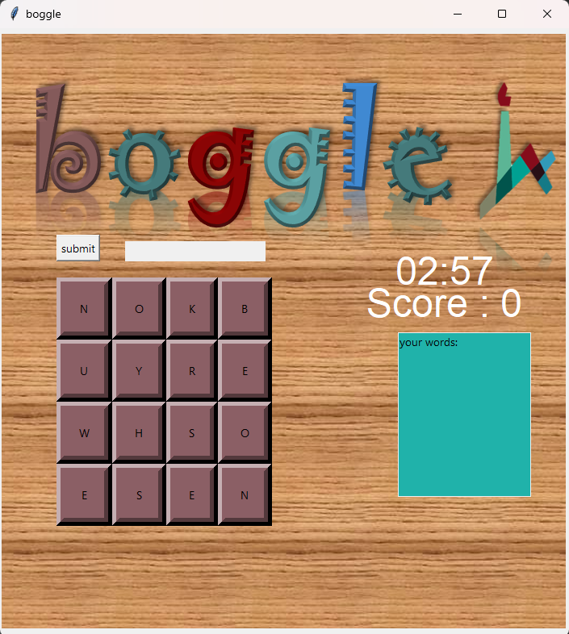
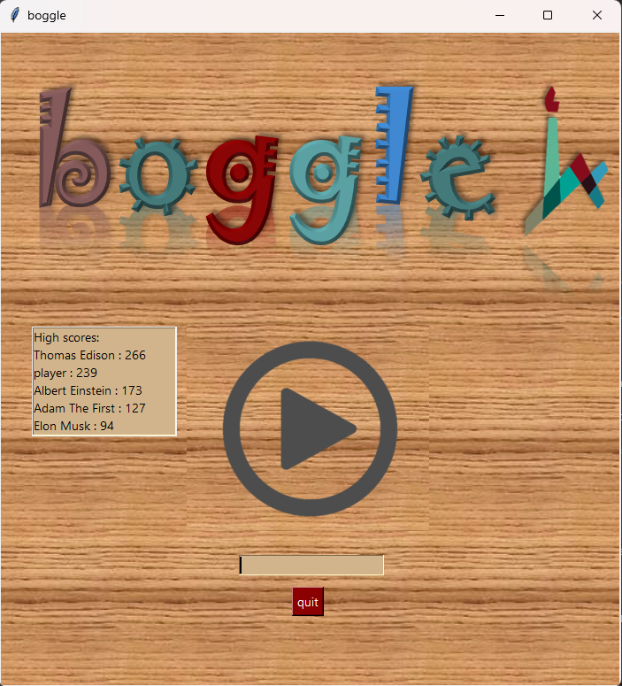

# Boggle Game

This is a classic Boggle game built using Python and the Tkinter library for the graphical user interface (GUI). Boggle is a word game where players attempt to find as many words as possible from a grid of randomly arranged letters within a certain time limit.

## Description

The Boggle Game project is a beginner-friendly Python project that combines logic, data structures, and GUI programming.

The game features:

- A randomized 4x4 letter grid for each new game
- A countdown timer (3 minutes)
- Score calculation based on the length of the words found
- Word validation against a dictionary file
- Highscore tracking for players

This project serves as an excellent learning resource for beginner programmers to grasp core programming concepts, data manipulation, and GUI development using Python and Tkinter.

## Screenshots

*Gameplay*



*Highscores*




## Usage

To run the Boggle Game on your local machine, follow these steps:

1. Clone the repository:
   ```
   git clone https://github.com/your-username/boggle-game.git
   ```

2. Navigate to the project directory:
   ```
   cd boggle-game
   ```

3. Ensure you have Python installed on your system.

4. Run the main script:
   ```
   python boggle.py
   ```
